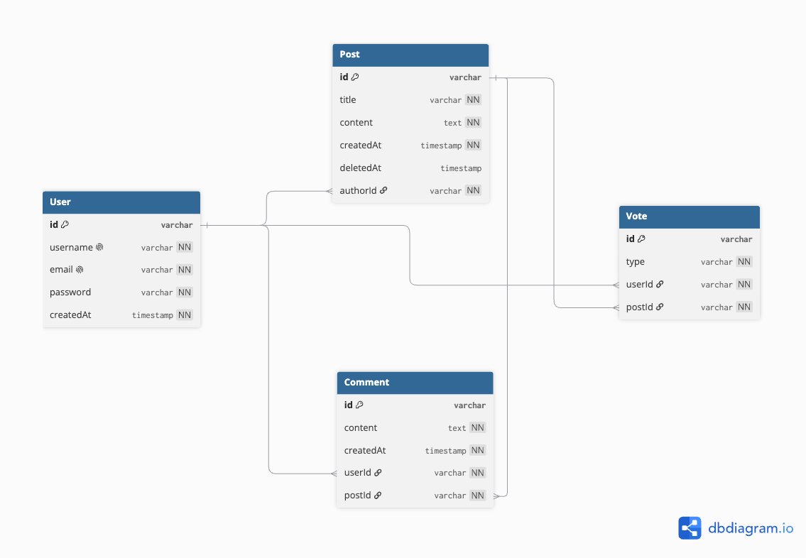

# Mini Reddit

Mini Reddit is a simplified Reddit-like social media application built using Next.js, TypeScript, Tailwind CSS, PostgreSQL, and Prisma ORM.

Users can create accounts, create posts, vote on posts, add comments, search posts, and view their profile and reputation score.

## Features

### Authentication

* User Registration
* User Login
* User Logout
* Password hashing using bcrypt
* Session-based authentication
* Protected pages and actions

### Posts

* Create posts
* View all posts
* View individual posts
* Edit own posts
* Posts can only be edited within 10 minutes of creation
* Soft delete posts
* Maximum 5 posts per user per hour


### Voting

* Upvote posts
* Downvote posts
* Remove a vote by clicking the same vote again
* Change Upvote to Downvote
* Change Downvote to Upvote
* One vote per user per post

### Comments

* Add comments to posts
* View comments under posts
* Delete own comments

### Search

Users can search posts by:

* Title
* Content

### User Profile

The profile page displays:

* Username
* Join Date
* Total Posts
* Reputation Score

### Reputation

Reputation is calculated using:

```text
Upvote   = +5
Downvote = -2
```

### Post Ranking

Posts are ranked using:

* Upvotes
* Downvotes
* Comments
* Post age

Current ranking formula:

```text
Score =
(Upvotes × 5)
- (Downvotes × 2)
+ (Comments × 2)
- (Post Age in Hours × 0.1)
```

### Responsive Design

The application supports:

* Desktop
* Tablet
* Mobile

## Tech Stack

### Frontend

* Next.js
* React
* TypeScript
* Tailwind CSS

### Backend

* Next.js Server Actions

### Database

* PostgreSQL
* Supabase

### ORM

* Prisma ORM

### Authentication / Validation

* bcryptjs
* jose
* Zod

## Project Structure

```text
mini-reddit/
│
├── app/
│   ├── actions/
│   │   ├── auth.ts
│   │   ├── post.ts
│   │   ├── vote.ts
│   │   └── comment.ts
│   │
│   ├── login/
│   ├── register/
│   ├── profile/
│   ├── posts/
│   │   ├── create/
│   │   └── [id]/
│   │       └── edit/
│   │
│   ├── loading.tsx
│   ├── layout.tsx
│   └── page.tsx
│
├── lib/
│   ├── prisma.ts
│   └── session.ts
│
├── prisma/
│   ├── migrations/
│   └── schema.prisma
│
├── prisma.config.ts
├── package.json
└── README.md
```

## Database Models

The application contains four main database models:

```text
User
 ├── Posts
 ├── Votes
 └── Comments

Post
 ├── Author
 ├── Votes
 └── Comments

Vote
 ├── User
 └── Post

Comment
 ├── User
 └── Post
```
## ER Diagram

The database ER Diagram for the Mini Reddit application is shown below:




## Environment Variables

Create a `.env` file in the root directory.

```env
DATABASE_URL="your_database_url"
DIRECT_URL="your_direct_database_url"
SESSION_SECRET="your_session_secret"
```

Do not upload the `.env` file to GitHub.

## Installation

Clone the repository:

```bash
git clone https://github.com/Matheesha2002/Mini-Reddit-project.git
```

Go to the project directory:

```bash
cd Mini-Reddit-project
```

Install dependencies:

```bash
npm install
```

Generate Prisma Client:

```bash
npx prisma generate
```

Run database migrations:

```bash
npx prisma migrate dev
```

Start the development server:

```bash
npm run dev
```

Open the application in the browser:

```text
http://localhost:3000
```

## Prisma Studio

To view database records:

```bash
npx prisma studio
```

Prisma Studio allows you to view:

* Users
* Posts
* Votes
* Comments

## Production Build

Run:

```bash
npm run build
```

The project should compile successfully without TypeScript or Next.js build errors.

## Business Rules

* Only authenticated users can create posts, vote, and comment.
* A user can vote only once per post.
* Clicking the same vote again removes the vote.
* Users can only edit their own posts.
* Posts can only be edited within 10 minutes of creation.
* Users can only delete their own posts.
* Post deletion uses Soft Delete.
* Deleted posts remain in the database.
* Deleted posts display:

```text
This post has been deleted. lol
```

* Comments remain associated with deleted posts.
* A user can create a maximum of 5 posts per hour.
* Users can only delete their own comments.

## Build Status

```text
Next.js Production Build: Successful
TypeScript Check: Successful
Database Migration: Successful
```

## Author

Kavindu Matheesha

## License

This project was developed as part of an internship self-study assignment.

## Live Demo

https://mini-reddit-project.vercel.app
